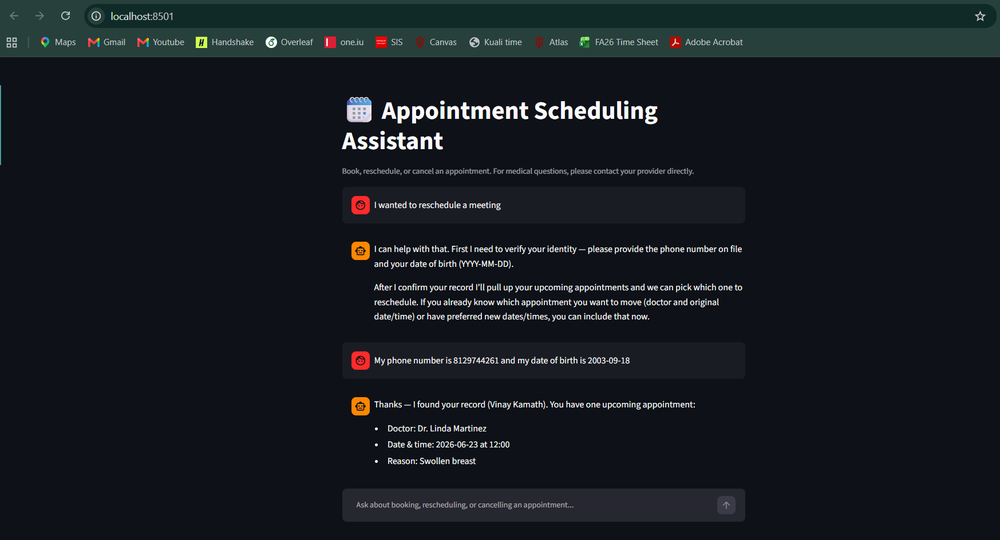
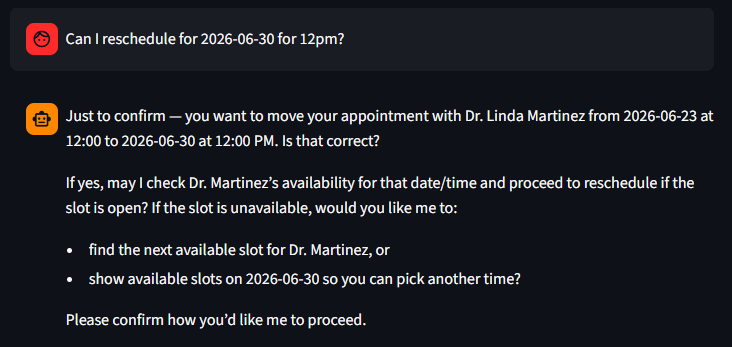
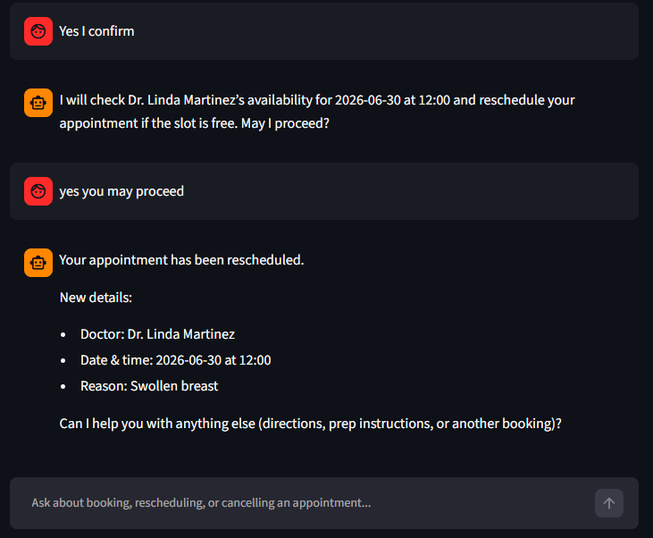
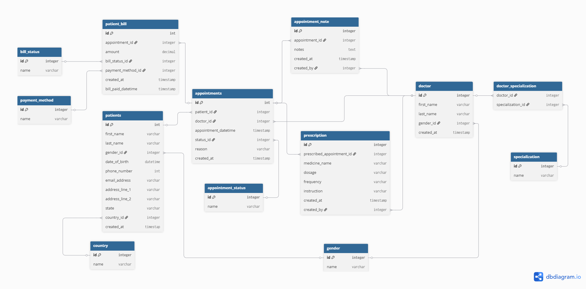

# Healthcare Appointment Scheduling AI Agent

An AI agent that lets patients book, reschedule, and cancel healthcare appointments through a chat conversation instead of a phone call to the front desk.

## Demo



<table>
<tr>
<td></td>
<td></td>
</tr>
</table>

## Table of Contents
- [Why I Built This](#why-i-built-this)
- [Features](#features)
- [Tech Stack](#tech-stack)
- [Architecture](#architecture)
- [Database Schema](#database-schema)
- [Getting Started](#getting-started)
- [Usage](#usage)
- [Project Structure](#project-structure)
- [Limitations & Next Steps](#limitations--next-steps)
- [License](#license)
- [Disclaimer](#disclaimer)

## Why I Built This

Most healthcare scheduling still happens over the phone, and it's a worse experience for everyone involved than it needs to be. A large majority of healthcare appointments — by some estimates as high as [88%](https://wellbeingmagazine.com/how-can-clinics-use-digital-ads-to-generate-more-appointments/) — are still booked by calling the front desk, with the average call running well past eight minutes. That manual process produces long hold times, double-bookings, and missed follow-ups, and a meaningful share of booked slots go unused simply because nobody got a reminder or an easy way to reschedule.

This project explores an alternative: treat scheduling and intake as one connected conversational workflow instead of a phone call and a stack of paperwork. A patient messages an agent to find a slot with the right provider; the agent checks real availability, confirms identity, and books the visit in that same conversation. The same approach extends naturally to the tasks that otherwise fall on front-desk staff — registering new patients on the spot rather than mailing them a form, and handling reschedules without a round of phone tag.

The goal isn't to remove people from the process. It's to take the purely mechanical parts of scheduling — "is Tuesday at 2pm open," "what's your date of birth," "let's move that to Thursday instead" — off a person's plate, so front-desk staff have more room for the parts of the job that actually need a human, and patients get an answer faster than waiting on hold.

## Features

- **Identity verification** — confirms a patient's identity by phone number and date of birth before accessing or changing any record
- **Real-time availability** — checks actual booked appointments against clinic hours instead of guessing
- **Full appointment lifecycle** — book, reschedule, and cancel appointments through conversation
- **Specialization-aware doctor search** — finds an appropriate provider type when a patient describes a need rather than naming someone specific
- **New patient registration** — registers patients with no existing record, with built-in duplicate protection so the same person can't be registered twice
- **Safety guardrails** — never gives medical advice, and breaks out of the scheduling flow immediately if a patient describes a medical emergency, directing them to call 911 instead of continuing to book
- **Two interfaces** — a Streamlit chat UI for normal use, and a command-line loop for fast testing without the UI

## Tech Stack

| Layer | Technology |
|---|---|
| Language | Python |
| Agent orchestration | LangGraph |
| LLM integration | LangChain + OpenAI (`gpt-5-mini`) |
| Database | MySQL |
| Interface | Streamlit |
| Dependency management | [uv](https://docs.astral.sh/uv/) |

## Architecture

The project is split into layers, each with one job, so a change to the agent's behavior never requires touching the database code and vice versa:

```
streamlit_app.py   chat UI, holds conversation state across turns
       |
agent_graph.py      LangGraph state machine -- the agent <-> tools loop
       |
agent_tools.py       LangChain tool definitions the model is allowed to call
       |
db.py                MySQL connection pool + parameterized queries
       |
   MySQL database
```

The model never writes SQL itself. It decides which tool to call and with what arguments; the tools run fixed, parameterized queries against the database. That separation is deliberate — it keeps the model's job limited to natural-language understanding and judgment calls (is this the right doctor, did the patient confirm this time), while every actual database write goes through the same validated code path regardless of how the conversation got there.

## Database Schema

The schema centers on `patients` and `appointments`, with `doctor`, `doctor_specialization`, and `specialization` modeling which providers treat what, and a handful of small lookup tables (`gender`, `country`, `appointment_status`, `bill_status`, `payment_method`) keeping categorical values consistent and indexable rather than stored as free text. `patient_bill`, `prescription`, and `appointment_note` hang off `appointments`, capturing billing, prescriptions, and visit notes tied to a specific visit rather than duplicated onto the patient record.



## Getting Started

### Prerequisites
- Python 3.11+
- MySQL 8.0 or newer (the patient lookup relies on `REGEXP_REPLACE`, added in MySQL 8.0)
- An OpenAI API key
- [uv](https://docs.astral.sh/uv/) installed

### 1. Clone the repo
```bash
git clone https://github.com/VinayKamath/appointment-scheduling-ai-chatbot.git
cd appointment-scheduling-ai-chatbot
```

### 2. Install dependencies
```bash
uv sync
```

### 3. Set up the database
```bash
mysql -u your_mysql_user -p < healthcare_database_schema.sql
mysql -u your_mysql_user -p < seed_data.sql
```
The seed data is entirely fictional and exists to make the agent testable end-to-end without needing real patient records.

### 4. Configure environment variables
Copy the template and fill in your own values:
```bash
cp .env.example .env
```
```
OPENAI_API_KEY=your-key-here
DB_HOST=localhost
DB_USER=your-mysql-username
DB_PASSWORD=your-mysql-password
DB_NAME=hospital_appointment_scheduling
```

### 5. Run it
Command line, for fast iteration without the UI:
```bash
uv run python agent_graph.py
```
Or the full Streamlit chat interface:
```bash
uv run streamlit run streamlit_app.py
```

## Usage

A typical conversation looks something like this:

```
You: Hi, I'd like to book an appointment with a cardiologist
Assistant: I can help with that. First, could I get your phone number and date of birth to pull up your record?
You: 415-555-0173, 1990-06-23
Assistant: Thanks, found your record. Dr. Sarah Mitchell handles Cardiology and has openings on June 25th at 9:30 AM or 10:00 AM -- would either work?
You: 9:30 works for me
Assistant: You're booked with Dr. Mitchell on June 25th at 9:30 AM for a cardiology visit. Anything else I can help with?
```

## Project Structure

```
.
├── db.py                          # MySQL connection pool + data access functions
├── agent_tools.py                 # LangChain tool definitions for the agent
├── agent_graph.py                 # LangGraph agent: state machine + system prompt
├── streamlit_app.py               # Streamlit chat interface
├── healthcare_database_schema.sql # Database schema (CREATE TABLE statements)
├── seed_data.sql                  # Fictional seed data for local testing
├── pyproject.toml / uv.lock       # Dependency management (uv)
├── .env.example                   # Template for required environment variables
└── docs/
    └── er_diagram.png             # Entity-relationship diagram
```

## Limitations & Next Steps

This is a prototype built to learn agentic AI patterns end to end, not a production scheduling system. Known gaps, in rough order of how much they'd matter before real use:

- No hard confirmation gate before database writes beyond what's prompted in the system prompt -- booking and cancellation rely on instructed model behavior, not a separate enforced approval step
- No database-level constraint preventing two appointments from landing on the same provider and time slot, so concurrent requests could double-book
- Clinic hours are hardcoded (9 AM-5 PM, 30-minute increments) rather than pulled from a real per-provider schedule
- Tested against fictional seed data in a local environment only -- not yet run against a live production database or real traffic
- Not configured for HIPAA compliance: no Business Associate Agreements in place with any hosting or LLM provider, no audit logging, no encryption-at-rest setup. Not suitable for real patient data in its current form.

## License

Not yet specified. If you build on this, add a `LICENSE` file with whichever terms you'd like to apply.

## Disclaimer

This project uses entirely fictional patient and provider data for development and testing. It's a learning and portfolio project, not a certified or production-ready medical scheduling system, and isn't intended for use with real patient health information as-is.
